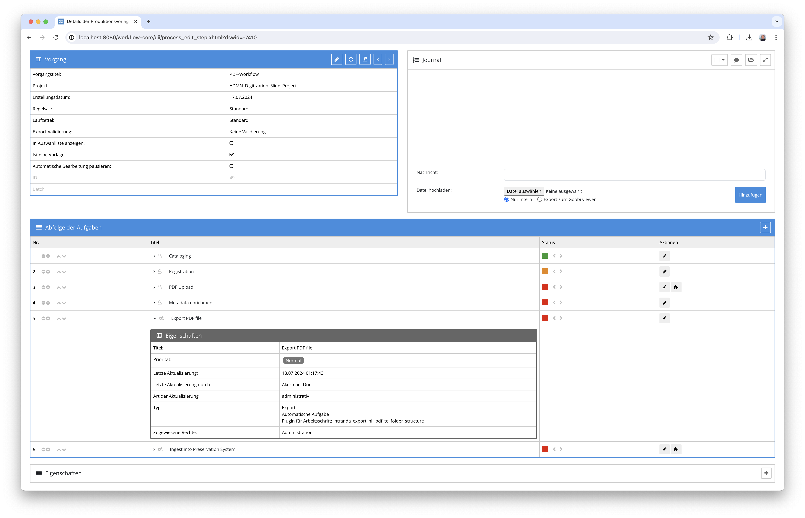
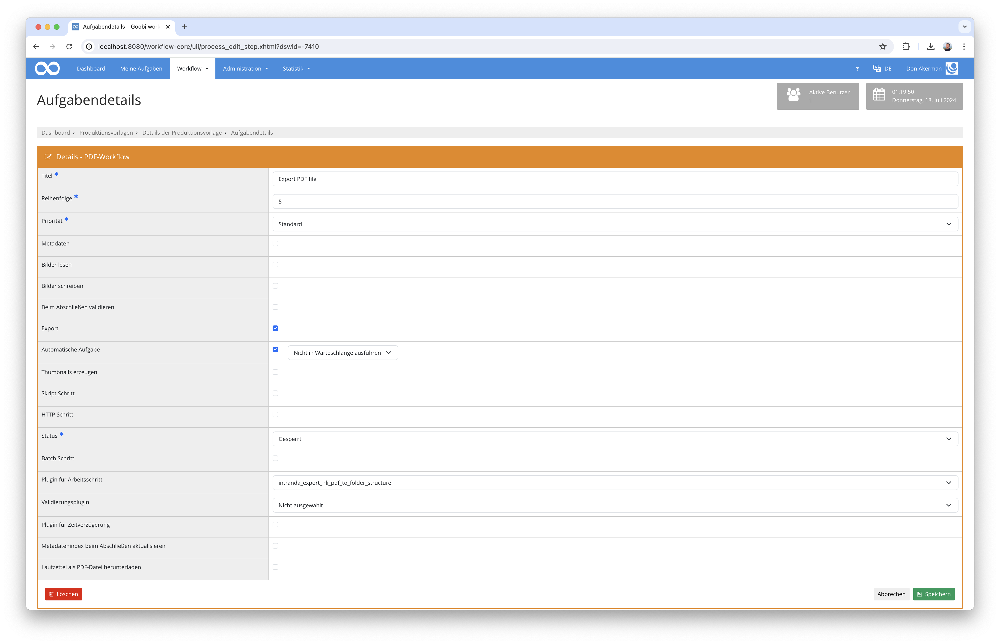

## Einführung
Diese Dokumentation erläutert das Plugin für ZZZ.

## Installation
Um das Plugin nutzen zu können, müssen folgende Dateien installiert werden:

```bash
/opt/digiverso/goobi/plugins/export/plugin-export-ZZZ-base.jar
/opt/digiverso/goobi/config/plugin_intranda_export_ZZZ.xml
```

Nach der Installation des Plugins kann dieses innerhalb des Workflows für die jeweiligen Arbeitsschritte ausgewählt und somit automatisch ausgeführt werden. Ein Workflow könnte dabei beispielhaft wie folgt aussehen:



Für die Verwendung des Plugins muss dieses in einem Arbeitsschritt ausgewählt sein:




## Überblick und Funktionsweise
ZZZ


## Konfiguration
Die Konfiguration des Plugins erfolgt in der Datei `plugin_intranda_export_ZZZ.xml` wie hier aufgezeigt:

{{CONFIG_CONTENT}}

Die darin verwendeten Parameter werden hier beschrieben: 

Parameter               | Erläuterung
------------------------|------------------------------------
``                      | 
``                      | 
``                      | 
``                      | 
``                      | 
``                      | 
``                      | 
``                      | 
``                      | 
``                      | 
``                      | 
``                      | 
``                      | 
``                      | 
``                      | 
``                      | 
``                      | 
``                      | 
``                      | 
``                      | 
``                      | 
``                      | 
``                      | 
``                      | 
``                      | 
``                      | 
``                      | 
